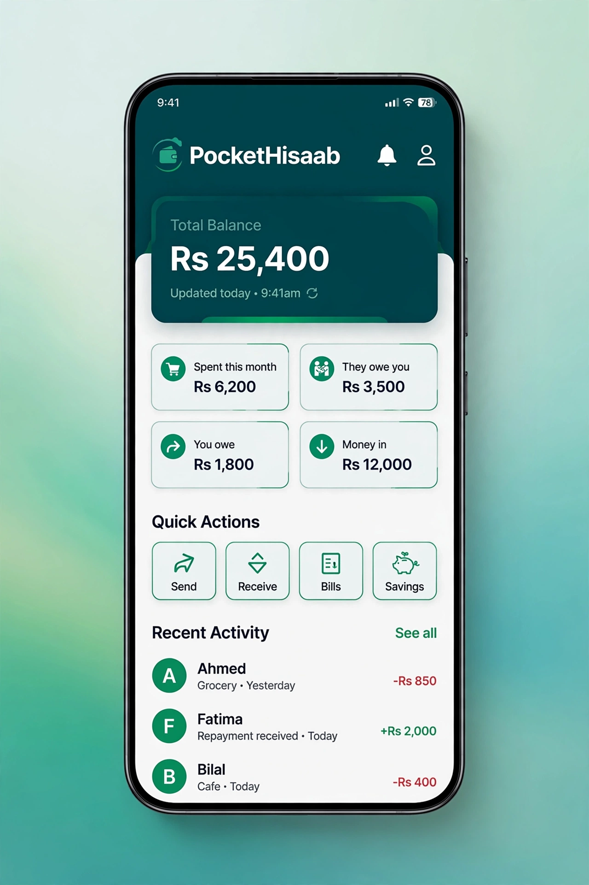
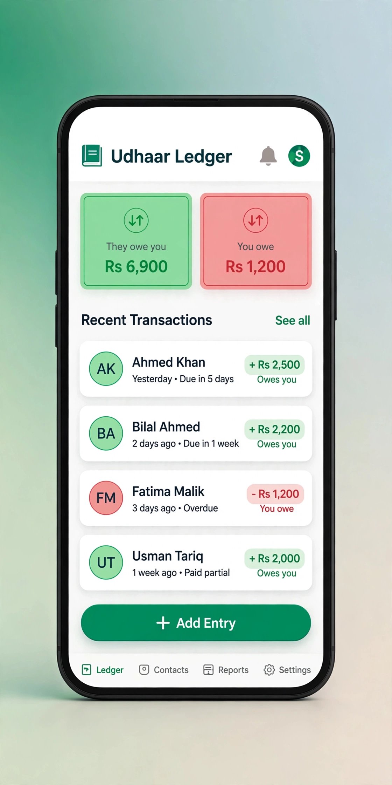
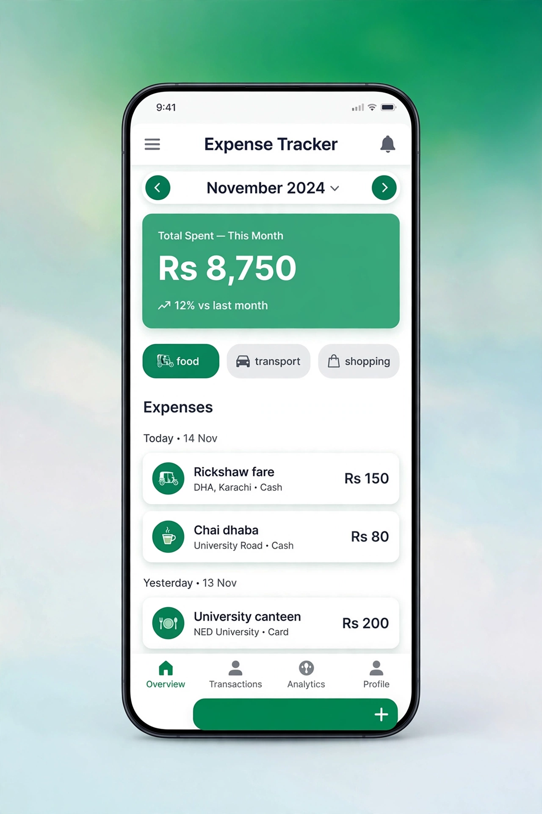

<div align="center">

# 💰 PocketHisaab

**Your pocket money, udhaar & expenses — all in one place.**

[](https://expo.dev)
[](https://reactnative.dev)
[](https://www.typescriptlang.org)
[](https://www.sqlite.org)

*100% offline. 100% private. Your data never leaves your phone.*

[📥 Download APK](../../releases) · [🐛 Report a bug](../../issues)

</div>

---

## 📱 Screenshots

<div align="center">
  
  
  
</div>

---

## ✨ Features

| | |
|---|---|
| 🏠 **Home Dashboard** | Total balance hero card, month stats, quick-add buttons, recent activity |
| 🤝 **Udhaar Ledger** | Track who owes you & who you owe — per-person history, one-tap settle |
| 🧾 **Expense Tracker** | Log spending by category, filter by month, group by date |
| 💵 **Pocket Money** | Record money received (allowance etc.) so your balance stays real |
| 📊 **Stats** | Money in vs out, net savings, 6-month bar chart, top categories |

## 🔒 Privacy by design

PocketHisaab has **no backend, no login, no tracking**. Everything is stored in a
local SQLite database on your device (`pockethisaab.db`). Install it on ten
phones and each one gets its own fresh, private database — nobody can ever see
anyone else's data. It works fully offline.

## 🚀 Run it yourself

```bash
git clone https://github.com/hussnainahmedd/pockethisaab.git
cd pockethisaab
npm install
npx expo start
```

Then scan the QR code with the **Expo Go** app, or press `a` for an Android
emulator.

## 📦 Build the APK

```bash
npx eas-cli@latest login
npx eas-cli@latest build -p android --profile preview
```

Or grab the ready-made APK from the [Releases](../../releases) page and install
it directly on your phone.

## 🛠️ Tech stack

- **Expo** + **React Native** + **Expo Router** — one codebase, Android & iOS
- **TypeScript** — type-safe throughout
- **expo-sqlite** — local on-device database
- Zero backend. Zero cost. Zero tracking.

---

<div align="center">

Made with ❤️ by [Hussnain Ahmad](https://github.com/hussnainahmedd)

</div>
